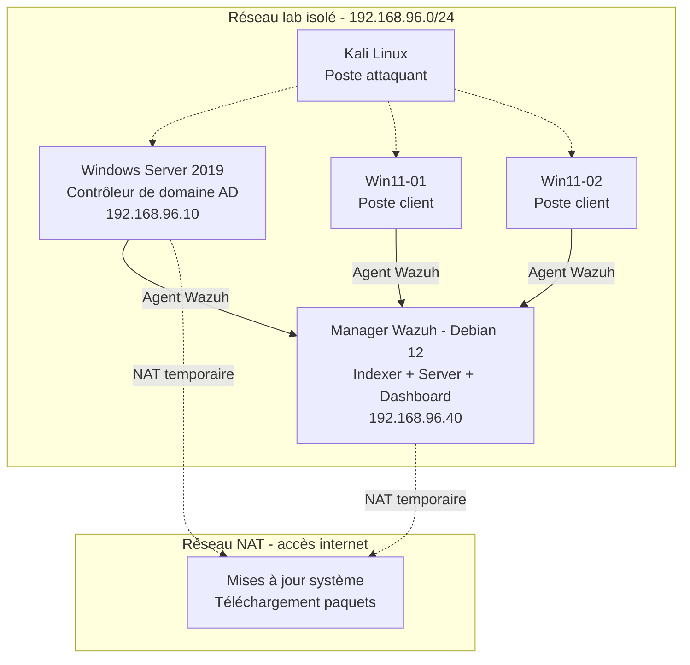

# SOC Home Lab — Wazuh SIEM + Sysmon sur environnement Active Directory simulé

## 🎯 Objectif du lab

Monter une infrastructure de détection SOC complète et fonctionnelle : SIEM open source (Wazuh), agents déployés sur un environnement Windows/Active Directory simulé, et enrichissement de la télémétrie via Sysmon.

---

## 🏗️ Architecture



| Machine | Rôle | OS | IP (réseau lab) |
|---|---|---|---|
| Manager Wazuh | Indexer + Server + Dashboard (all-in-one) | Debian 12 (Bookworm) | 192.168.96.40 |
| Contrôleur de domaine | Active Directory | Windows Server 2019 | 192.168.96.10 |
| Poste client 1 | Endpoint surveillé | Windows 11 | DHCP |
| Poste client 2 | Endpoint surveillé | Windows 11 | DHCP |
| Poste attaquant | Outils offensifs (nmap, etc.) | Kali Linux | - |

**Choix de segmentation réseau** : chaque VM dispose de deux cartes réseau — une sur le réseau lab isolé (`192.168.96.0/24`, sans passerelle, sans sortie internet) et une seconde en NAT, activée uniquement lors des installations/mises à jour système. Cette séparation reproduit le principe de moindre exposition : le fonctionnement quotidien du SIEM et la communication agents ↔ manager ne dépendent jamais d'un accès internet.

---

## 🛠️ Mise en œuvre

### 1. Déploiement du manager Wazuh

Installation all-in-one (indexer + server + dashboard) sur Debian 12 via le script officiel :

```bash
curl -sO https://packages.wazuh.com/4.14/wazuh-install.sh
sudo bash wazuh-install.sh -a
```

### 2. Déploiement des agents Windows

Sur chaque machine Windows (serveur AD + postes clients), déploiement via PowerShell :

```powershell
Invoke-WebRequest -Uri https://packages.wazuh.com/4.x/windows/wazuh-agent-4.14.7-1.msi -OutFile $env:tmp\wazuh-agent
msiexec.exe /i $env:tmp\wazuh-agent /q WAZUH_MANAGER='192.168.96.40' WAZUH_AGENT_NAME='<nom-agent>'
```

### 3. Installation de Sysmon (visibilité endpoint enrichie)

Configuration de détection communautaire (fork Neo23x0 de la config SwiftOnSecurity de référence) :

```powershell
Invoke-WebRequest -Uri https://download.sysinternals.com/files/Sysmon.zip -OutFile Sysmon.zip
Expand-Archive -Path Sysmon.zip -DestinationPath Sysmon
Invoke-WebRequest -Uri https://raw.githubusercontent.com/Neo23x0/sysmon-config/master/sysmonconfig-export.xml -OutFile Sysmon\sysmonconfig.xml
& "Sysmon\Sysmon64.exe" -accepteula -i "Sysmon\sysmonconfig.xml"
```

### 4. Intégration du canal Sysmon dans l'agent Wazuh

Ajout dans `C:\Program Files (x86)\ossec-agent\ossec.conf` :

```xml
<localfile>
  <location>Microsoft-Windows-Sysmon/Operational</location>
  <log_format>eventchannel</log_format>
</localfile>
```

---

## 🔍 Investigation d'alertes — exemple concret

Le dashboard Wazuh remonte une alerte de sévérité élevée (niveau 12+) : accès au processus `lsass.exe` sur le contrôleur de domaine — un pattern classique de vol de credentials (technique MITRE ATT&CK *OS Credential Dumping*).

**Analyse menée :**
- `sourceImage` : `MsMpEng.exe` (moteur Windows Defender)
- `sourceUser` : `AUTORITE NT\Système`

**Conclusion** : faux positif confirmé — accès légitime de Windows Defender scannant `lsass.exe`, comportement natif de protection. Vérification indispensable avant tout classement d'alerte, l'automatisation seule ne suffit pas à trancher.

---

## ✅ Compétences démontrées

- Déploiement et administration d'un SIEM open source de bout en bout (Wazuh)
- Configuration et exploitation de Sysmon pour la télémétrie endpoint
- Cartographie et lecture d'alertes via MITRE ATT&CK
- Administration Linux (Debian) et Windows Server / Active Directory
- Diagnostic et résolution de problèmes réseau (VMware networking, DHCP, segmentation NAT/isolé)
- Méthodologie d'investigation : distinction faux positif / vrai positif à partir de la donnée brute

---

## 📌 Pistes d'évolution

- Scénario d'attaque complet depuis Kali (scan + brute-force + mouvement latéral) avec détection de bout en bout dans Wazuh
- Ajout d'un déploiement automatisé (GPO ou Ansible) pour les agents et Sysmon
- Intégration de règles de détection personnalisées (decoders/rules Wazuh)
